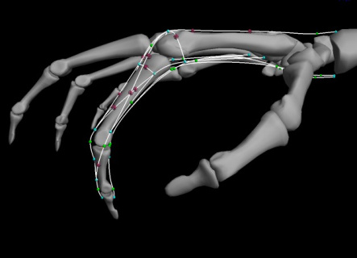
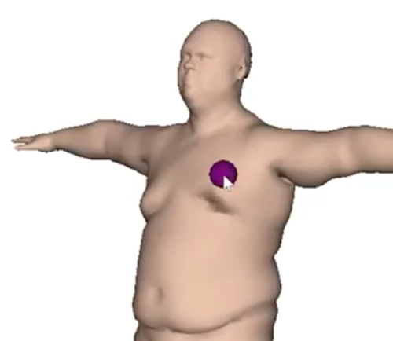
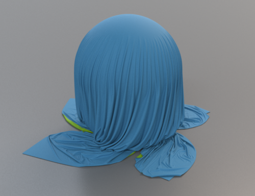
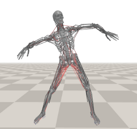
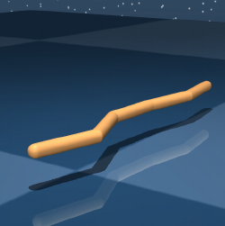
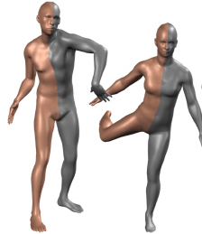
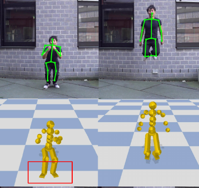

## Welcome!

This is the website of SMRT (Sensorimotor Reading and Thinking), a student/faculty co-led reading group at UBC CS. To remember the acronym, think of Homer Simpson singing, ["I am so smart, I am so smart, S-M-R-T."](http://www.youtube.com/watch?v=DhrfhjLd9e4).

**We welcome any UBC student with some background and interest in computer graphics, machine learning, physics-based simulation, vision-based motion understanding to join our group.** Very few students in the group are experts in all or any of the above topics, so please don't feel intimidated!

If you are interested in joinging the reading group, please post an issue on [this Github repo](https://github.com/ericchen321/ai4d/issues), and include 1) your UBC email and 2) a short description of yourself (year level, major, and research focus if you are a grad student) in it. And we will be in touch with you.

<!-- <table width="100%" border="0" cellspacing="0" cellpadding="0">
  <tr>
  <td></td>
  <td></td>
  <td></td>
  <td></td>
  <td></td>
  </tr>
</table> -->

     

---------------

## What Do We Read?

**Theme.** The theme of this reading group is _digital humans: graphics and machine Learning_.
More specifically, our focus spans multiple topics:
* Novel learning-based methods for simulation and control of (non) human characters;
* Novel learning-based methods for processing and simulating geometries;
* Geometric and/or biomechanical modelling of human body, skin, muscles and other tissues;
* Vision-based methods of human motion capture, analysis and synthesis.

**Publication venues.** We get to pick papers from a multitude of publication venues since our theme is quite interdisciplinary:
* Graphics: ACM SIGGRAPH, ToG, SCA, Eurographics;
* Vision: ICCV, CVPR;
* Robotics: ICRA, IROS;
* Machine Learning: NeurIPS, ICML, ICLR;
* Biomechanics: Journal of Biomechanics.

The list above is not exhaustive, and we welcome our fellow readers to suggest relevant papers from other venues. Ideally, we will focus on more recent papers (published in <=2 years) but there will be room for older but interesting papers. Textbook chapters are also welcome, so long as they are relevant and accessible to everyone.

**Upcoming, finished and suggested papers.** You can find the schedule of upcoming papers under Section [Upcoming Papers](https://www.cs.ubc.ca/labs/sensorimotor/SMRT/papers_upcoming/). Previously discussed papers are under [Discussed Papers](https://www.cs.ubc.ca/labs/sensorimotor/SMRT/papers_discussed/). Papers suggested by group members but not discussed yet are under [Suggested Papers](https://www.cs.ubc.ca/labs/sensorimotor/SMRT/papers_suggested/).

## How Do We Read Papers?
Each week someone presents a paper/tutorial, followed by discussion. For paper discussions, we structure each session around answering the following questions:
<ul>
    <li>Motivation and Contribution
      <ul>
          <li>What problem is the authors addressing? Are the authors qualified to provide an answer?</li>
          <li>Is the problem too broad? Too narrow?</li>
          <li>How does it relate to our topic(s) of interest, and to your own research?</li>
          <li>What are the implications of these results to theory, practice
            and/or future research in the field? </li>
      </ul>
    </li>
    <li>Method
      <ul>
        <li>What solution is offered to the problem? How does it work?</li>
        <li>Does the solution solve the stated problem?</li>
        <li>How does the author justify the solution: data, logic, experience,
          examples? Is the justification technically correct? Is it sufficient?</li>
      </ul>
    </li>
    <li>Limitations
      <ul>
        <li>How does it compare to existing methods? </li>
        <li>What assumptions and/or restrictions are made? Are they appropriate?</li>
      </ul>
    </li>
    <li>Related Work
      <ul>
        <li>What alterative solutions and related work are presented?</li>
        <li>What distinguishes other work from this one?</li>
        <li>Are too many of the citations to the author’s own work?</li>
        <li>Are there any citations missing?</li>
      </ul>
    </li>
</ul>
The above questions are adapted from [_Reading and Reviewing Academic Articles_]("https://www.cs.ubc.ca/~mitchell/Class/CS513.2009W1/Handouts/howToReview.pdf") by Prof. Ian M Mitchell at UBC.
